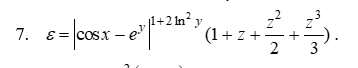
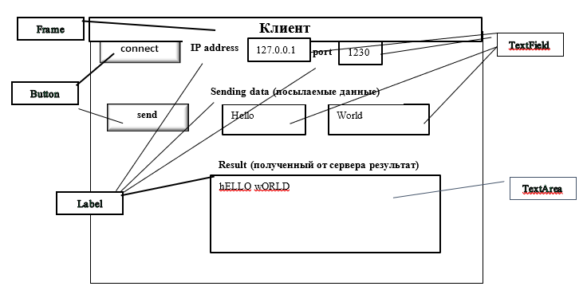

## Лабораторная работа №4 Часть 1. Вариант №7

Разработать приложение на основе TCP-соединения, позволяющее осуществлять взаимодействие клиента и сервера по совместному решению задач обработки информации
Приложение должно располагать возможностью передачи и модифицирования получаемых (передаваемых) данных

``` Вариант №7 : ```
1. Разработать приложение для нахождения обратной матрицы размером 3х3
2. Исходная матрица вводится на клиентской части и передается серверу, а тот в свою очередь возвращает клиенту обратную матрицу

## Лабораторная работа №3 Часть 2. Вариант №7
1. Разработать приложение на основе UDP-соединения, позволяющее осуществлять взаимодействие клиента и сервера по совместному решению задач обработки информации 
2. Приложение должно располагать возможностью передачи и модифицирования получаемых (передаваемых) данных


``` Вариант №7 : ```


```
Возможности клиента: 
1. Передать серверу исходные параметры (вводятся с клавиатуры) для расчета значения функции, а также получить расчетное значение функции
```
```
Возможности сервера: 
1. По полученным от клиента исходным параметрам рассчитать значение функции, передать клиенту расчетное значение функции
2. Сохранить исходные параметры и значение функции в файл
```

## Лабораторная работа №3 Часть 3. Вариант №7
1. Разработать приложение, позволяющее осуществлять взаимодействие клиента и сервера по совместному решению задач обработки информации
2. Протокол взаимодействия – TCP
3. Приложение клиента должно иметь GUI-интерфейс (рисунок) 
4. Приложение сервера можно оставить в консольной реализации
5. Сервер должен предоставлять возможность последовательного установления соединения с клиентами



``` Вариант №7 : ```
Сервер генерирует прогноз погоды на неделю. Клиент посылает день недели и получает соответствующий прогноз.
